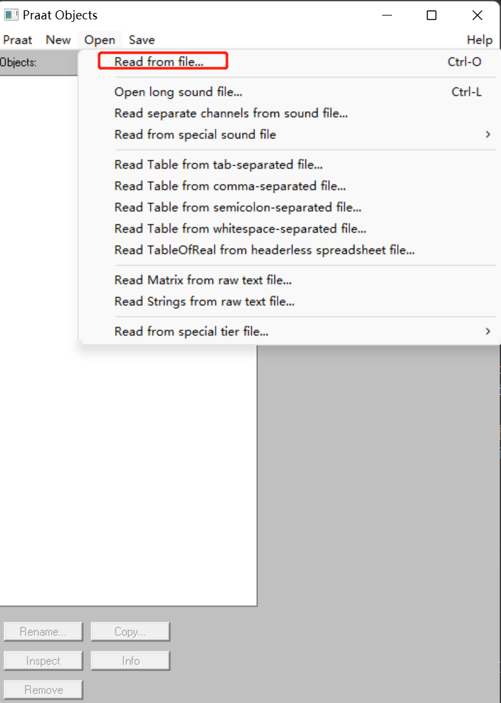

# __音素与音频__  

最近两年做MetaHuman的人越来越多了，而MetaHuman涉及到肢体的驱动和嘴部的驱动，嘴型的驱动又依靠声音。

声音驱动表情（包括口型）有很多方案，比较著名的是微软的视素驱动，[获取 lip-sync 的人脸姿态事件](https://docs.microsoft.com/zh-cn/azure/cognitive-services/speech-service/how-to-speech-synthesis-viseme?pivots=programming-language-cpp)，但好像根据语言也会有不同的视素，所以最终还是跟音素相关。  

现在很多语音厂商都能够同时提供音频对应的音素了，比如AiSpeech，Data Baker，但拿到音频和音素之后，我们先要想要的是 ———— 如何判断音素和音频在时间维度上对应的准确度。  

为了解决这个问题，我们先来介绍一个工具和一种格式。  


## __TextGrid格式__  

TextGrid一种专门对声音进行标注的文本格式，里面可以记录很多信息 [Praat scripting 入门 (2) TextGrid 和录音管理](https://zhuanlan.zhihu.com/p/388306735)。   

我一般用来标准音素时间戳，大概格式如下 

```TextGrid
File type = "ooTextFile"
Object class = "TextGrid"

xmin = 0
xmax = 2.3
tiers? <exists>
size = 3
item []:
    item [1]:
       class = "IntervalTier"
       name = "sentence"
       xmin = 0
       xmax = 2.3
       intervals: size = 1
       intervals [1]:
          xmin = 0
          xmax = 2.3
          text = "říkej ""ahoj"" dvakrát"
    item [2]:
       class = "IntervalTier"
       name = "phonemes"
       xmin = 0
       xmax = 2.3
       intervals: size = 3
       intervals [1]:
          xmin = 0
          xmax = 0.7
          text = "r̝iːkɛj"
       intervals [2]:
          xmin = 0.7
          xmax = 1.6
          text = "ʔaɦɔj"
       intervals [3]:
          xmin = 1.6
          xmax = 2.3
          text = "dʋakraːt"
    item [3]:
       class = "TextTier"
       name = "bell"
       xmin = 0
       xmax = 2.3
       points: size = 2
       points [1]:
          number = 0.9
          mark = "ding"
       points [2]:
          number = 1.3
          mark = "dong"
```

我们拿到厂商提供的音素之后，可以保存成这样的文件 [一个开源的TextGrid读写器](https://github.com/eiichiroi/textgrid.hpp)，此时，我们手中有了音频和对应的TextGrid文件。  

当然生成textgrid的代码也可以参考kaldi代码，kaldi是语音界的天花板和军火库，非常多的人从里面汲取营养，以后有兴趣或需要的时候，可以参考这个工程，后面我会单独写一篇文章，讨论如何使用kaldi，实现从音频到嘴型驱动的全流程。  


回到本文，有了audio和textgrid文件之后，该怎么把这两者结合起来使用呢？  

__Praat__  

## __Praat__  

Praat是语音界的一个神奇工具，而我只是用它来实现音素时间戳校准的工作。  




因为手头没有对应的音频文件和TextGrid（后面补齐），接下来的步骤是 

* 出现的界面中有两个文件，同时选中，就会在窗口右侧出现Edit and Continue按钮，此时点击这个按钮，就会出现一个界面，这个界面是上面是音频，下面是音素时间戳，每个音素时间戳占用1格（格子有大有小，跟duration有关），我们点击这个格子，就能提到这段格子所对应的音频，假设这个格子上标注的是 ang，但听到的声音明显不仅仅包含ang，比如杨 i ang2，如果我们听到了 i的声音，那么我们就可以证明，这个音素时间戳太靠前了。  

